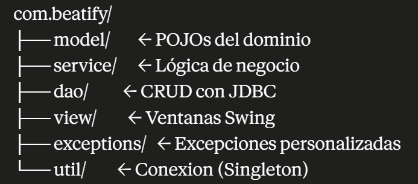

# Beatify

> Plataforma de streaming musical de escritorio enfocada en música regional colombiana.

**Universidad Popular del Cesar — Programación de Computadores III (SS462)**
Docente: Ing. Esp. Alfredo Bautista

---

## Equipo

| Integrante | Rol |
|---|---|
| Yilver Josué Silva Ospino | Líder técnico de Base de Datos y DAOs |
| Andrés Felipe Zabaleta Díaz | Modelos de dominio y lógica de servicio |
| Kendrick Javier Sayago Rincones | Vista Swing e integración |

---

## Stack tecnológico

| Componente | Tecnología |
|---|---|
| Lenguaje | Java 21 (LTS) |
| Build | Maven |
| UI | JavaFX 21.0.5 (FXML + Media) |
| Base de datos | Oracle Database XE 21c — esquema `BEATIFY` |
| JDBC | `ojdbc11` 23.3 |
| Seguridad | BCrypt (`jbcrypt 0.4`) para hash de contraseñas |
| Reproducción | JavaFX MediaPlayer (MP3 nativo) |
| APIs externas | MusicBrainz + Last.fm (cliente HTTP + Jackson 2.17) |
| Testing | JUnit Jupiter 5.10 |

---

## Arquitectura

El proyecto sigue una arquitectura en capas con separación clara de responsabilidades:

```
com.beatify/
├── api/          → Clientes HTTP a MusicBrainz y Last.fm (+ DTOs)
├── dao/          → Acceso a datos — 25 DAOs con JDBC puro
├── service/      → Lógica de negocio — interfaces + implementaciones
├── model/        → Entidades del dominio (POJOs)
├── util/         → Conexion (Singleton JDBC), PasswordUtil
└── exceptions/   → Jerarquía de excepciones propias de Beatify
```



---

## Base de datos

El esquema `BEATIFY` contiene **29 tablas** y **28 secuencias** en Oracle XE.

| Dominio | Tablas |
|---|---|
| Catálogo musical | `ARTISTA`, `ALBUM`, `CANCION`, `ARTISTA_GENERO`, `GENERO`, `COLABORACION` |
| Podcast | `PODCAST`, `EPISODIO` |
| Usuarios | `CLIENTE`, `SUSCRIPCION`, `PAGO`, `DISPOSITIVO` |
| Social | `PLAYLIST`, `CANCION_PLAYLIST`, `SEGUIMIENTO`, `LIKE_CANCION`, `LIKE_ALBUM`, `LIKE_PLAYLIST` |
| Reseñas | `RESENA`, `VOTO_RESENA` |
| Actividad | `REPRODUCCION`, `BUSQUEDA`, `NOTIFICACION` |
| Gamificación | `LOGRO`, `LOGRO_CLIENTE` |

Los scripts SQL están en la carpeta `db/` — ver [`db/README.md`](db/README.md) para instrucciones detalladas.

---

## Configuración local

### Requisitos previos

- Java 21 JDK
- Maven 3.9+
- Oracle Database XE 21c con la PDB `XEPDB1` activa

### 1. Preparar la base de datos

Ejecutar los scripts en orden desde SQL Developer:

```sql
-- Como SYSTEM @ XEPDB1
@db/00_setup_user.sql      -- crea el usuario BEATIFY

-- Como BEATIFY @ XEPDB1
@db/01_schema_beatify.sql  -- crea 25 tablas y 24 secuencias
@db/02_seed_data.sql       -- datos de prueba (géneros, artistas, álbumes, clientes)
@db/03_cache_apis.sql      -- tablas de caché para MusicBrainz y Last.fm
@db/04_cache_lastfm_artista.sql  -- cache de artistas de Last.fm
@db/05_plsql_resena.sql    -- function + trigger de validación polimórfica de RESEÑA
@db/06_sp_limpiar_cache.sql -- procedure para purgar entradas vencidas de cache
@db/07_sp_reset_datos.sql   -- procedure para resetear acciones de prueba (conservador)
@db/08_pkg_resenas.sql           -- PKG_RESENAS (CREAR, VOTAR, PROMEDIO, CONTAR)
@db/09_alter_cliente_activo.sql  -- ALTER CLIENTE ADD activo (soft-delete)
@db/10_pkg_cliente.sql           -- PKG_CLIENTE (REGISTRAR, EXISTE_CORREO, CONTAR_ACTIVIDAD, DESACTIVAR)
@db/11_pkg_suscripcion.sql       -- PKG_SUSCRIPCION (ACTIVAR, CANCELAR, TIENE_ACTIVA)
@db/12_pkg_reproduccion.sql      -- PKG_REPRODUCCION (REGISTRAR, TOTAL, TOP_GENERO)
@db/13_pkg_logros.sql            -- PKG_LOGROS (OTORGAR, EVALUAR_AUTO, CONTAR)
```

### 2. Configurar credenciales

Editar `src/main/resources/db.properties`:

```properties
db.url=jdbc:oracle:thin:@localhost:1521/XEPDB1
db.user=BEATIFY
db.password=beatify123
```

> ⚠️ Credenciales versionadas solo porque es un proyecto académico local. **No usar en producción.**

### 3. Compilar y ejecutar

```bash
# Compilar y empaquetar
mvn clean package

# Ejecutar con el plugin de JavaFX
mvn javafx:run

# O ejecutar el JAR directamente
java -jar target/BeatifyApp-1.0-SNAPSHOT.jar
```

---

## Funcionalidades

- **Streaming con MediaPlayer**: reproducción de MP3 vía JavaFX Media nativo.
- **Enriquecimiento automático**: `EnriquecimientoService` consulta MusicBrainz y Last.fm para completar metadatos de artistas y álbumes.
- **Reseñas con calificación** (estilo Letterboxd): estrellas 1-5 + comentario + votos de otros usuarios.
- **Logros / Achievements**: gamificación del descubrimiento musical.
- **Cápsulas del tiempo**: vista cronológica del historial de escucha.
- **Música del barrio**: top regional según la ciudad del cliente.
- **Playlists colaborativas**: gestión de canciones en playlists con orden personalizado.
- **Autenticación segura**: contraseñas hasheadas con BCrypt.

---

## Estado del proyecto

- ✅ Fase 1: Documentación (problema, objetivos, requerimientos)
- ✅ Fase 2: Arquitectura (paquetes, clases, mockups, GRASP/SOLID)
- 🔄 Fase 3: Desarrollo (en curso)
   - ✅ Esquema BD completo — 29 tablas, secuencias, constraints
   - ✅ Seed data — géneros, artistas, álbumes, canciones, clientes
   - ✅ Capa DAO — 25 DAOs implementados con JDBC
   - ✅ Capa Service — interfaces + implementaciones para todos los DAOs
   - ✅ Integración APIs externas — `LastFmClient`, `MusicBrainzClient`, `EnriquecimientoService`
   - ✅ Utilidades — Singleton de conexión, `PasswordUtil` BCrypt
   - 🔄 Capa de presentación JavaFX — en desarrollo (rama `feat/andres-modelos`)
- ⏳ Fase 4: Documentación final
